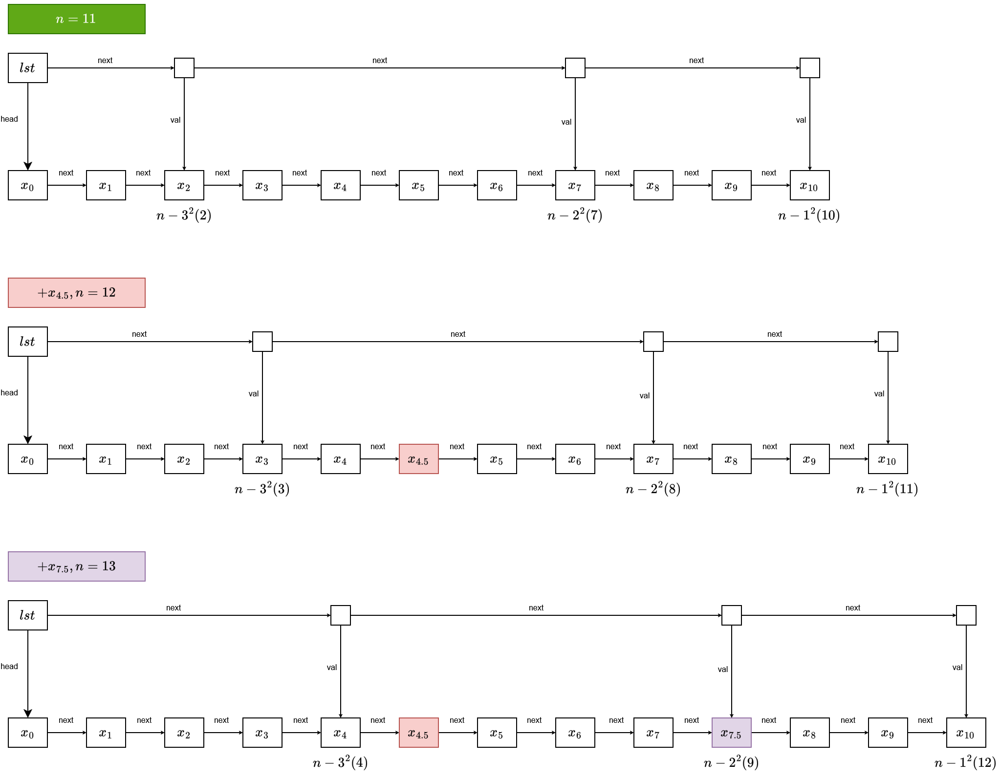

# Liste chaînées sousb stéroïdes

LAVENANT Jordan - APP3 IIM

## 1.

Dans une bobliste de taille $n$, l'indice de la case pointée par la première **bobcase** est équivalent à :

$$n - \lfloor\sqrt{n}\rfloor^2$$

Avec $n$ taille de la bobliste et $\lfloor\sqrt{n}\rfloor$ la partie entière inférieure de la racine carrée de $n$.

Pour l'implémentation de la fonction `getElement`, voici une explication de la logique que j'ai emprunté :

- On stocke `best_cell` et `best_index` pour suivre la meilleure _bobcase_ trouvée, et son indice associé dans la liste.
- On profite de la structure de la bobliste pour avancer rapidement vers l'index `i`, sans le dépasser, en utilisant les _bobcases_, ce qui permet de réduire le nombre d'accès à la liste principale.
  - On met à jour à chaque itération la meilleure _bobcase_ trouvée.
  - Pour obtenir l'index de la _bobcase_, on utilise la formule mentionnée précédemment, qui nous donne l'indice de la case pointée par la _bobcase_, puis on décrémente cet indice à chaque itération pour suivre la progression dans la liste.
- Une fois que nous avons trouvé la meilleure _bobcase_ (celle dont l'indice est le plus proche de `i` sans le dépasser), nous continuons à parcourir la liste principale à partir de la _case_ associée à notre _bobcase_, pour trouver l'élément à l'index `i`.

La complexité de cet algorithme est de $O(\sqrt{n})$ dans le pire car il y a exactement $k = \lfloor\sqrt{n}\rfloor$ _bobcases_ à parcourir.

## 2.

### Add

Pour l'implémentation de la fonction `add`, voici une explication de la logique que j'ai suivie :

- J'ai d'abord créer ma nouvelle instance de _case_ avec la valeur à ajouter.
- Ensuite si la liste non-vide, j'attribue la pointeur suivant à la tête actuelle de la liste, et je met à jour la tête de la liste pour qu'elle pointe vers ma nouvelle _case_. Si la liste est vide, je met simplement la tête de la liste à ma nouvelle _case_. Enfin, j'incrémente la taille de la liste.
- Ensuite, je vérifie si la taille de la liste a atteint un seuil qui nécessite l'ajout d'une nouvelle _bobcase_. Je vérifie donc :

  $$\lfloor\sqrt{n}\rfloor^2 = n$$

  _(Avec $n$ la taille de la liste après l'ajout de l'élément)_.

  Ce qui signifie que nous avons atteint un nombre d'éléments qui correspond à un carré parfait, et qu'il faut ajouter une nouvelle _bobcase_ pour maintenir la structure de la bobliste.

  Si cette condition est vérifiée, j'ajoute une nouvelle _bobcase_ à la liste des _bobcases_, en pointant vers la _case_ actuelle (qui est la tête de la liste après l'ajout de l'élément), et mettantà jour le pointeur _next_ de la nouvelle _bobcase_ pour qu'il pointe vers la précédente _bobcase_ (si elle existe).

### Pop

Pour l'implémentation de la fonction `pop`, voici une explication de la logique que j'ai suivie :

- Je vérifie d'abord si la liste est vide. Si c'est le cas, je retourne `None`.
- Sinon, je stocke la valeur de la tête de la liste (la _case_ actuelle) pour pouvoir la retourner à la fin de la fonction.
- Ensuite, je mets à jour la tête de la liste pour qu'elle pointe vers la _case_ suivante, et je décrémente la taille de la liste.
- Vu que notre foncton `pop` supprime l'élément à la tête de la liste, je vérifie la valeur du pointeur de la _bobhead_ de ma liste secondaire. Si ce pointeur est égal à la _case_ que je viens de supprimer, cela signifie que la _bobcase_ ne doit plus être maintenue, car elle ne pointe plus vers une _case_ valide. Dans ce cas, je mets à jour la _bobhead_ pour qu'elle pointe vers la _bobcase_ suivante (si elle existe).
- Enfin je retourne la _case_ que j'avais stockée au début de la fonction, qui correspond à l'élément supprimé de la liste.

## 3.

Le choix de l'espacement non-constant entre les _cases_ pointées par les _bobcases_ permet d'optimiser les performances de la structure de données, en particulier pour les opérations de recherche et d'accès aux éléments. En utilisant des indices basés sur des carrés parfaits, on peut réduire le nombre d'accès nécessaires pour trouver un élément à un index donné, car cela permet de sauter rapidement à des positions clés dans la liste.

Les _cases_ pointées sont plus rapprochées à la fin de la liste principale afin de permettre un accès rapide, peu-importe l'indice recherché. En effet, cela permet d'accéder rapidement aux éléments situés vers la fin de la liste, et qui auraient nécessité de parcourir une grande partie de la liste si les _bobcases_ étaient espacées de manière constante, ou si la liste secondaire n'existait pas du tout.

Un grand espacement en début de liste n'est pas nécessaire, car les éléments situés au début de la liste sont plus facilement accessibles en parcourant la liste principale.

## 4.

## 5.

Pour l'implémentation de la fonction `insertSorted`, voici une explication de la logique que j'ai suivie :

- Je vérifie d'abord si la liste est vide ou si la valeur à insérer est inférieure ou égale à la valeur de la tête de la liste. Si c'est le cas, j'utilise simplement la fonction `add` pour ajouter l'élément au début de la liste, car elle conservera l'état de tri de la liste.
- On stocke `best_cell` pour suivre la meilleure _bobcase_ trouvée.
- On profite de la structure de la bobliste pour parcourir notre liste, sans dépasser la valeur `v`, en utilisant les _bobcases_, ce qui permet de réduire le nombre d'accès à la liste principale.
  - On met à jour à chaque itération la meilleure _bobcase_ trouvée.

- Une fois que nous avons trouvé la meilleure _bobcase_ (celle dont son pointeur correspond à la _case_ dont la valeur est la plus proche de `v` sans la dépasser), nous continuons à parcourir la liste principale à partir de la _case_ associée à notre _bobcase_, pour trouver la position d'insertion de `v` (c'est-à-dire la première _case_ dont la valeur est supérieure à `v`).
- Une fois que nous avons trouvé la position d'insertion, nous créons une nouvelle _case_ avec la valeur `v`, et nous mettons à jour les pointeurs pour insérer cette nouvelle _case_ à la position correcte dans la liste, en maintenant l'ordre trié.

- Ensuite nous devons mettre à jour la bobliste, dû au changement d'état de la liste principale.
  - Nous devons dans un premier temps vérifier si l'insertion de `v` a entraîné un dépassement du seuil pour l'ajout d'une nouvelle _bobcase_, pointant vers la _case_ de la tête de la liste. Si c'est le cas, nous devons ajouter une nouvelle _bobcase_ pour maintenir la structure de la bobliste.
    - Pour cela, nous calculons la valeur entière inférieure de la racine carrée de la taille actuelle de la liste avant insertion ($L.n - 1$), et la valeur entière inférieure de la racine carrée de la taille de la liste après l'insertion de `v` ($L.n$).
    - Si ces valeurs sont différentes, cela signifie que nous avons atteint un nouveau seuil pour l'ajout d'une _bobcase_, et nous devons en ajouter une nouvelle en pointant vers la _case_ de la tête de la liste.
  - Enfin, nous devons mettre à jour les pointeurs des _bobcase_ pointant vers les _case_ ayant des valeurs inférieures à `v` (seul celles-ci sont affectées par l'insertion de `v`). Elles doivent ainsi pointer vers la _case_ suivante leur ancien pointeur, pour maintenir la validité de la bobliste (cf. [Dessin d'insertions](#4)).

## 6.
